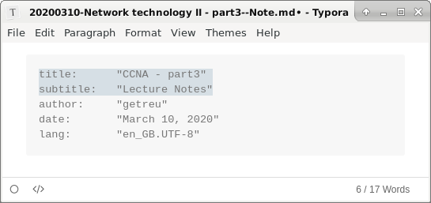
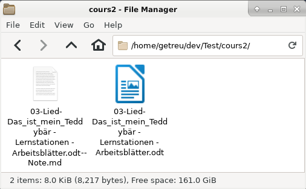
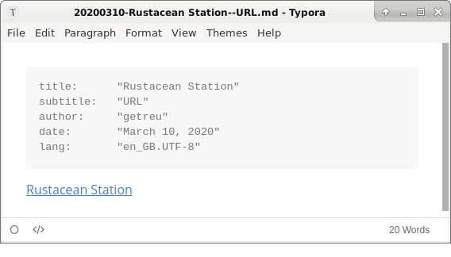
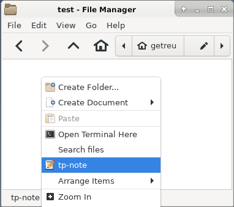
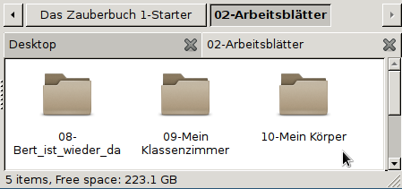
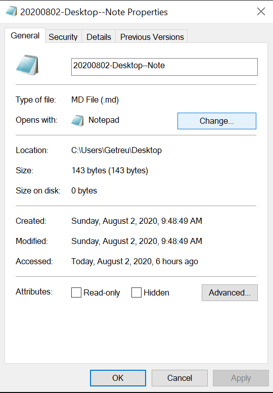
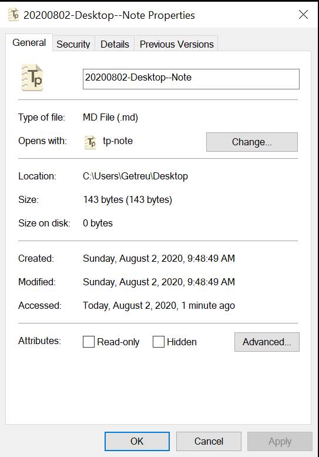
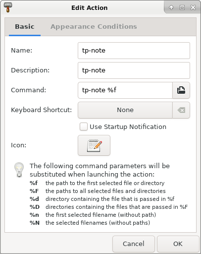
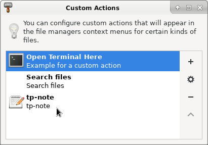

Markup languages like *Markdown*, *ReStructuredText*, *asciidoc*, *textile*,
*txt2tags* or *mediawiki* are perfectly suited for fast note-taking. Type
your notes with your favourite editor and chose your favourite markup
language[^1].

_Tp-Note_ helps you to quickly get started writing notes with its powerful
template system. As _Tp-Note_ takes care that the note's filename is always
synchronized with its document title, you will find back your notes easily.

_Tp-Note_ is available for Linux, Windows and iOS. This manual illustrates
its main use-cases and how to get started:

1. Fast start note-taking (when the lecture starts).
2. Take a note about an existing (downloaded) file.
3. Bookmark and comment a hyperlink.

If you want to customize _Tp-Note_ with own templates, another markup
language, please consult the [man-page] for more technical details.

The project is hosted on Github:
[getreu/tp-note](https://github.com/getreu/tp-note). The project's webpage is on
[http://blog.getreu.net](http://blog.getreu.net/projects/tp-note/).
The documentation of this project is dived into tow parts:

* User manual

  [Tp-Note user manual - html](https://blog.getreu.net/projects/tp-note/tp-note--manual.html)

  [Tp-Note user manual - pdf](https://blog.getreu.net/_downloads/tp-note--manual.pdf)

* Unix man-page (more technical)

  [Tp-Note manual page - html](https://blog.getreu.net/projects/tp-note/tp-note--manpage.html)

  [Tp-Note manual page - pdf](https://blog.getreu.net/_downloads/tp-note--manpage.pdf)


# How students take notes

A fellow student still uses paper and pen. I ask her why, and she replied "I can
better concentrate. My computer distracts me. I will do all other things, but
not listening.".

This is certainly true. As far as I am concerned, I am not good at logistics.
For me having all documents and notes in one little machine is a blessing.

The following sections illustrate how to work with _Tp-Note_ with my most
common workflows.


## Fast start note-taking (when the lecture starts)

{width="12cm"}

Alternatively you can open the folder you want to create a new note in and
right-click on some empty white space.

{width="12cm"}

{width="13cm"}

{width="13cm"}

{width="13cm"}

{width="12cm"}

> **Note**
>
> Before and after launching the editor _Tp-Note_ renames the file to be in
> sync with the note's metadata (i.e. title and subtitle).
> For more details see [Document title - filename sync]


## Taking notes about a file

{width="11cm"}

{width="13cm"}

The source-code of the note shows, that the link has a  target. The left-click, opens the `.odt` document.

```yaml
---
title:      "03-Lied-Das_ist_mein_Teddybär - Lernstationen - Arbeitsblätter"
subtitle:   "Note"
author:     "getreu"
date:       "March 10, 2020"
lang:       "en_GB.UTF-8"
revision:   "1.0"
---

[03-Lied-Das_ist_mein_Teddybär - Lernstationen - Arbeitsblätter.odt](03-Lied-Das_ist_mein_Teddybär - Lernstationen - Arbeitsblätter.odt)
```

{width="13cm"}

{width="12cm"}


## Bookmark and comment a hyperlink


{width="14cm"}

To copy a link in markdown format a browser addon is needed. I recommend the
addons [Copy as Markdown] and [Copy Selection as Markdown] available
for Firefox.

[Copy as Markdown]: https://addons.mozilla.org/en-GB/firefox/search/?q=copy%20as%20markdown
[Copy Selection as Markdown]: https://addons.mozilla.org/en-GB/firefox/addon/copy-selection-as-markdown/?src=search

{width="11cm"}

{width="13cm"}

The source code of the note shows the link target:

```yaml
---
title:      "Rustacean Station"
subtitle:   "URL"
author:     "getreu"
date:       "March 10, 2020"
lang:       "en_GB.UTF-8"
revision:   "1.0"
---

[Rustacean Station](https://rustacean-station.org/)
```

In this example we copied only one Markdown-link "Rustacean Station".
Furthermore, *Tp-Note* allows you also to insert a list of Markdown links in a
template. For example with [Copy as Markdown] you could copy a link list of all
open tabs. In this case, _Tp-Note_ would retain only the name of the first link
as document title, whereas the whole link-list would appear in the body of the
note.

{width="13cm"}

{width="9cm"}

```{=docbook}
<?dbfo-need height="6cm" ?>
```


## Copy a page from a book

{width="14cm"}

{width="9cm"}

{width="13cm"}

```{=docbook}
<?dbfo-need height="4cm" ?>
```

The source code of the note shows the completed template:

```yaml
---
title:      "Winston kept his back turned to the telescreen"
subtitle:   "Note"
author:     "getreu"
date:       "2020-03-23"
lang:       "en_GB.UTF-8"
revision:   "1.0"
---

Winston kept his back turned to the telescreen. It was safer, though, as he well
knew, even a back can be revealing. A kilometre away the Ministry of Truth, his
place of work, towered vast and white above the grimy landscape...
```

In this example we copied only text. *Tp-Note* suggests the first sentence as
title. This can be changed before saving as illustrated above. Here we just save
and observe the file on the disk.

{width="8cm"}

```{=docbook}
<?dbfo-need height="6cm" ?>
```

## Best practise

_Tp-Note's_ greatest advantage is it's flexibility. It easily integrates with
your workflow.  As people work differently, there is no best usage either.
Nevertheless, after having used _Tp-Note_ for some months now, here my personal
preferences and configuration:

* [Tp-Note](https://blog.getreu.net/projects/tp-note/)
* Addon for Firefox: [Copy Selection as Markdown]
* Markdown editor : [Typora](https://typora.io/)
* Integration with you file-manager as described below.

My favorite Markdown editor at the moment is [Typora](https://typora.io/). I
like its clean and simple interface helping me to concentrate on the content
while writing.[^3] 

When copying extracts from a web-page I often need to preserve its hyperlinks.
For this, the Firefox browser addon [Copy Selection as Markdown] is very handy.
It precedes the copied extract with a hyperlink to the origin of the webpage.
When _TP-Note_ reads the extract from the clipboard, it uses the first Markdown
hyperlink it can find for composing the note's title and its filename on disk.
This is why the webpage's name ends up automatically in the note's title and
filename.  Here a sample work flow:

{width=12cm}

{width="12cm"}

{width="9cm"}

{width="11cm"}

{width="9cm"}

Note, no content or filename was edited manually in this example. _Tp-Note_
takes care of interpreting the clipboard's content and generating the file on
disk.

[Copy Selection as Markdown]: https://addons.mozilla.org/en-GB/firefox/addon/copy-selection-as-markdown/?src=search


# How it works: Organize your files and notes with sort-tags

Consider the following _Tp-Note_-file:

    20151208-Make this world a better place--Suggestions.md

The filename has 4 parts:

    {{ sort-tag }}-{{ title }}--{{ subtitle }}.{{ extension }}

A so called _sort-tag_ is a numerical prefix at the beginning of the
filename. It is used to order files and notes in the file system. Besides
numerical digits, a _sort-tag_ can be any combination of
`0123456789-_`[^sort-tag] and is usually used as:

* *chronological sort-tag*

        20140211-Reminder.doc
        20151208-Manual.pdf

* or as a *sequence number sort-tag*.

        02-Invoices
        08-Tax documents
        09_02-Notes

The figures below illustrate organizing files with *sort-tags".

{width="12cm"}

{width="8cm"}

When _Tp-Note_ creates a new note, it prepends automatically a *chronological
sort-tag* of today. The `{{ title }}` part is usually derived from the parent
directory's name omitting its own *sort-tag*.

[^sort-tag]: The characters `_` and `-` are not considered to be
part of the *sort-tag* when they appear in first or last position.


# Installation

Depending on the operating system, the installation process is more
or less automated and can be divided up into two steps:

1. Binary installation\
   This step consists of downloading _Tp-Note_'s binary and copying it to your hard-disk.
   See section [Distribution](https://blog.getreu.net/projects/tp-note/#distribution)
   on _Tp-Note_'s [project page](https://blog.getreu.net/projects/tp-note/#distribution)
   for a list of available packages and binaries.

2. Optional integration with the filemananger.

At the moment of this writing, an installer automating steps 1. and 2. is available for 
Windows only. Packages for Debian Linux and Ubuntu help you with step 1. For other operating
systems check section [Distribution](https://blog.getreu.net/projects/tp-note/#distribution)
for precompiled binaries or 
[build Tp-Note](https://blog.getreu.net/projects/tp-note/#building-and-installing)
yourself.


```{=docbook}
<?dbfo-need height="6cm" ?>
```

## Minimum setup without file-manager integration

_Tp-Note_'s template engine can be tested and used without window manager integration. This
section shows a minimum setup to get started quickly.

* **Windows**

  Download the
  [tp-note executable for Windows](https://blog.getreu.net/projects/tp-note/_downloads/x86_64-pc-windows-gnu/release/tp-note.exe) [^4]
  and place it on your desktop.

* **Linux**

  Download the _Tp-Note_-binary for Linux and place it on your Desktop:

  ``` sh
  > cd ~/Desktop
  > wget https://blog.getreu.net/projects/tp-note/_downloads/x86_64-unknown-linux-gnu/release/tp-note
  > chmod 755 tp-note
  ```

A new _Tp-Note_-icon appears on your desktop.


## Usage of the minimum setup

To create a new note, either double-click on the _Tp-Note_-icon, or drag a
folder or file and drop it on the _to-note_-icon. This opens an editor with
your new note.

For more comfort, I recommend integrating _Tp-Note_ into the file-manager's
context menu. See section [Integration with file manager] for more details.
There you also will find a list of tested Markdown-editors, if you wish to use
one. _Tp-Note_ works with every Unicode text editor and Markdown-editor (see
section [Optional customization] and man-page for more details).

_Tp-Note_'s note-files can be converted into e.g. `.docx`, `.odt`, `.html` with
[Pandoc](https://pandoc.org/) and then printed.


```{=docbook}
<?dbfo-need height="6cm" ?>
```

## Troubleshooting

* **Windows**

  When you see only Chinese characters in notepad, update Windows to the
  latest version or install [Notepad++](https://notepad-plus-plus.org/).

  Display _Tp-Note_'s error messages:

  1. Open the command-prompt: Click on *Windows-Start*, type `cmd` and [Enter].

  2. Type:

         Desktop\tp-note.exe -d >Desktop\debug.txt 2>&1

     This creates the file `debug.txt` on your desktop. Open the file
     and scroll to the end.

* **Linux**

  Display _Tp-Note_'s error messages:

  1. Open a console and change to the directory where you saved the
     _Tp-Note_-executable.

  2. Type:

         > tp-note -d 2>&1 | less

```{=docbook}
<?dbfo-need height="6cm" ?>
```

## Optional customization

* Your preferred markup language is not *Markdown*, but *ReStructuredText*,
  *T2t*, *Textile*, *Wiki*, *Mediawiki* or *Asciidoc*? Change it!
  
  Please refer to _Tp-Note_'s man-page to learn how to change its
  templates in the configuration file.

* Your preferred text editor is not *Notepad*? Change it![^1]

  Note-taking with _Tp-Note_ is more fun with a good markup (Markdown)
  text editor, although any Unicode text editor will do (even Notepad >=
  Windows 10-update 1903). _Tp-Note_ it preconfigured to work with:
  
  - [Typora — a markdown editor, markdown reader.](https://typora.io/)
    Make sure that you have at least version 0.9.89 installed, as this version
    contains a [bugfix](https://github.com/typora/typora-issues/issues/3348)
    required to work properly with _Tp-Note_.

  - [ReText — Simple but powerful editor for Markdown and reStructuredText](https://github.com/retext-project/retext)

  - _VS-Code_, _Atom_ ...

  Please refer to _Tp-Note_'s man-page to learn how to register your text
  editor in _Tp-Note_'s configuration file.

* You prefer working in a desktop environment instead of working on a shell?

  Read [Integration with file manager].


# Optional integration with your file manager

This section shows how to integrate _Tp-Note_ in the context menu of your
file manager. The context menu appears, when you click right on a file icon,
on a directory icon or on the white space in between (cf. figure below). In
the following we will configure the file-manager to launch _Tp-Note_ with the
path to the selected icon.

{width="12cm"}

```{=docbook}
<?dbfo-need height="6cm" ?>
```

## Windows file explorer configuration

_Tp-Note_ is distributed with a Microsoft Windows Installler package
`tp-note-x.x.x-x86_64.msi`, which automates the following key registration.
Omit this section if you have installed _Tp-Note_ through this `.msi` package!

1. Make the directory `C:\Windows\tp-note\bin\` and move `tp-note.exe`
   into it.

2. Open the *notepad* text editor and paste the following registry-key into
   it.

        Windows Registry Editor Version 5.00
        
        [HKEY_CLASSES_ROOT\Directory\Background\shell\New Tp-Note]
 
        [HKEY_CLASSES_ROOT\Directory\Background\shell\New Tp-Note\command]
        @="\"C:\\Program Files\\tp-note\\bin\\tp-note.exe\""
        
        [HKEY_CLASSES_ROOT\*\OpenWithList\tp-note.exe]
        @=""
 
        [HKEY_CLASSES_ROOT\SystemFileAssociations\.md\shell\edit.tp-note.exe]
        @="Edit Tp-Note"
 
        [HKEY_CLASSES_ROOT\SystemFileAssociations\.md\shell\edit.tp-note.exe\command]
        @="\"C:\\Program Files\\tp-note\\bin\\tp-note.exe\" \"%1\""


3. Save the file as: 

   * File name: `tp-note.reg`
   * Save as type: `All files`
   * Encoding:  `UTF-16 LE`


4. Double-click on `tp-note.reg` and confirm several times.

5. Assign `tp-note` as default application for `.md`-files

   

   


## Linux file manager configuration

To simplify the configuration we first place the binary _Tp-Note_
in our `$PATH`:

```sh
> cd /usr/local/bin
> sudo wget https://blog.getreu.net/projects/tp-note/_downloads/x86_64-unknown-linux-gnu/release/tp-note
> sudo chmod 755 tp-note
```

_Debian_ and _Ubuntu_ user can also download [Debian/Ubuntu package] and install it with:

``` sh
> sudo dpkg -i tp-note_X.X.X_amd64.deb
```


### Configure Thunar's custom actions

Most file-manager allow extending the context menu. As an example, the
following images show the configuration of the *Thunar*-file-manger.
In *Thunar*'s menu go to:

    Edit -> Configure custom actions...

{width="10cm"}

{width="10cm"}

{width="10cm"}

{width="10cm"}

[Debian/Unbuntu package]: https://blog.getreu.net/projects/tp-note/#tp-note-debianubuntu-installer-package


```{=docbook}
<?dbfo-need height="4cm" ?>
```


### Configure Thunar's custom actions system-wide

Alternatively, instead of manually adding custom actions for each user, you can
do this system-wide:

    sudo nano /etc/xdg/Thunar/uca.xml

Search for `</actions>` and replace it with:

```xml
<action>
        <icon>accessories-text-editor</icon>
        <name>Tp-Note</name>
        <command>tp-note %f</command>
        <description>Tp-Note</description>
        <patterns>*</patterns>
        <directories/>
        <audio-files/>
        <image-files/>
        <other-files/>
        <text-files/>
        <video-files/>
</action>
</actions>
```

The change becomes effective only after the user deletes his own configuration
file in `~/.config/Thunar/uca.xml`.

```{=docbook}
<?dbfo-need height="8cm" ?>
```


### Configure Pcmanfm's custom actions system-wide

_Pcmanfm_ is the default file-manager _Lubuntu_ and in _Raspbian_ on the 
Raspberry Pi.

Create the configuration file:

    sudo nano /usr/local/share/file-manager/actions/tp-note.desktop

with the following content:

```
[Desktop Entry]
Type=Action
Name[en]=Tp-Note
Tooltip=Tp-Note
Icon=package-x-generic
Profiles=profile-zero;

[X-Action-Profile profile-zero]
Name[en]=Default profile
Exec=tp-note %f
```

The above creates the custom context-menu item _Tp-Note_.


[^1]: _Tp-Note_ is preconfigured to work with many well-known external text
editors: e.g.: `code`, `atom`, `retext`, `geany`, `gedit`, `mousepad`,
`leafpad`, `nvim-qt`, and `gvim` under Linux and `notpad++` and `notepad`
under Windows.  To register your own text editor, please consult the man-page.
For best user experience, I recommend text editors with internal markup
previewer.

[^2]: For a personalized setup read _Tp-Note_'s man-page.

[^3]: Make sure to install a recent version of
[Typora](https://typora.io/#download) (version >=0.9.89).

[^4]: Versions for other operating systems and a Debian package are 
[available here](https://blog.getreu.net/projects/tp-note/_downloads/).

