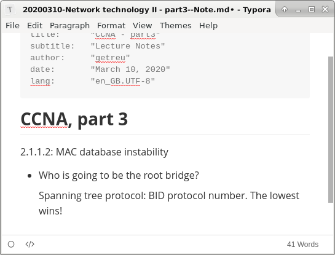
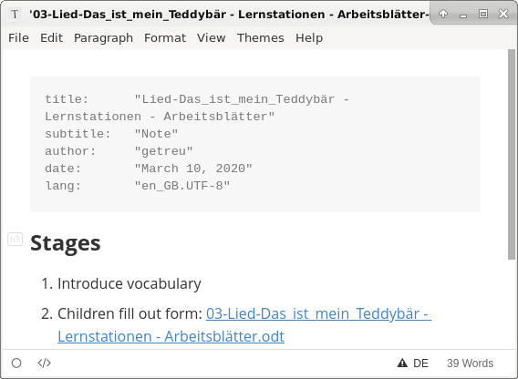
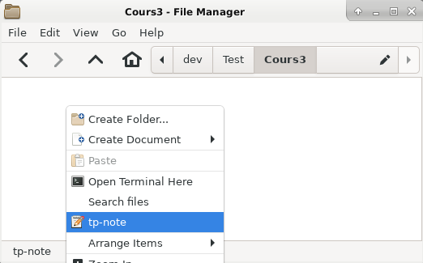
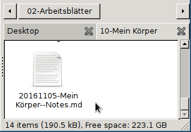

Markup languages like *Markdown*, *ReStructuredText*, *asciidoc*, *textile*,
*txt2tags* or *mediawiki* are perfectly suited for fast note-taking. Type
your notes with your favourite editor and chose your favourite markup
language[^1].

_tp-note_ helps you to quickly get started writing notes with its powerful
template system. As _tp-note_ takes care that the note's filename is always
synchronized with its document title, you will find back your notes easily.

_tp-note_ is available for Linux, Windows and iOS. This manual illustrates
its main use-cases and how to get started:

1. Fast start note-taking (when the lecture starts).
2. Take a note about an existing (downloaded) file.
3. Bookmark and comment a hyperlink.

If you want to customize _tp-note_ with own templates, another markup
language, please consult the [man-page] for more technical details.

The project is hosted on Github:
[getreu/tp-note](https://github.com/getreu/tp-note). The project's webpage is on
[http://blog.getreu.net](http://blog.getreu.net/projects/tp-note/).
The documentation of this project is dived into tow parts:

* User manual

  [tp-note user manual - html](https://blog.getreu.net/projects/tp-note/tp-note--manual.html)\
  [tp-note user manual - pdf](https://blog.getreu.net/_downloads/tp-note--manual.pdf)

* Unix man-page (more technical)

  [tp-note manual page - html](https://blog.getreu.net/projects/tp-note/tp-note--manpage.html)\
  [tp-note manual page - pdf](https://blog.getreu.net/_downloads/tp-note--manpage.pdf)
* User-manual: [user-manual-pdf] (this document ), also available as [pdf]


# How students take notes

A fellow student still uses paper and pen. I ask her why, and she replied "I can
better concentrate. My computer distracts me. I will do all other things, but
not listening.".

This is certainly true. As far as I am concerned, I am not good at logistics.
For me having all documents and notes in one little machine is a blessing.

To illustrate how to work with _tp-note_ here my most common workflows.


## Fast start note-taking (when the lecture starts)

{width="12cm"}

Alternatively you can open the folder you want to create a new note in and
right-click on some empty white space.

{width="12cm"}

{width="16cm"}

{width="16cm"}

{width="13cm"}

{width="12cm"}

> **Note**
>
> Before and after launching the editor _tp-note_ renames the file to be in
> sync with the note's metadata (i.e. title and subtitle).
> For more details see [Document title - filename sync](#)


## Taking notes about a file

{width="11cm"}

{width="13cm"}

The source-code of the note shows, that the link has a  target. The left-click, opens the `.odt` document.

```yaml
---
title:      "03-Lied-Das_ist_mein_Teddybär - Lernstationen - Arbeitsblätter"
subtitle:   "Note"
author:     "getreu"
date:       "March 10, 2020"
lang:       "en_GB.UTF-8"
revision:   "1.0"
---

[03-Lied-Das_ist_mein_Teddybär - Lernstationen - Arbeitsblätter.odt](03-Lied-Das_ist_mein_Teddybär - Lernstationen - Arbeitsblätter.odt)
```

{width="13cm"}

{width="12cm"}


## Bookmark and comment a hyperlink


{width="14cm"}

To copy a link in markdown format a browser addon is needed. I am using the
addons *Copy as markdown* and *Copy selection as markdown* available for
Firefox.

{width="11cm"}

{width="13cm"}

The source code of the note shows the link target:

```yaml
---
title:      "Rustacean Station"
subtitle:   "URL"
author:     "getreu"
date:       "March 10, 2020"
lang:       "en_GB.UTF-8"
revision:   "1.0"
---

[Rustacean Station](https://rustacean-station.org/
```

{width="13cm"}

{width="9cm"}

```{=docbook}
<?dbfo-need height="6cm" ?>
```

# How it works: Organize your files and notes with sort-tags

Consider the following _tp-note_-file:

    20151208-Make this world a better place--Suggestions.md

The filename has 4 parts:

    {{ sort-tag }}-{{ title }}--{{ subtitle }}.{{ extension }}

A so called _sort-tag_ is a numerical prefix at the beginning of the
filename. It is used to order files and notes in the filesystem. Besides
numerical digits, a _sort-tag_ can be any combination of
`0123456789-_`[^sort-tag] and is usually used as:

* *chronological sort-tag*

        20140211-Reminder.doc
        20151208-Manual.pdf

* or as a *sequence number sort-tag*.

        02-Invoices
        08-Tax documents
        09_02-Notes

The figures below illustrate organizing files with *sort-tags".

{width="12cm"}

{width="8cm"}

When _tp-note_ creates a new note, it prepends automatically a *chronological
sort-tag* of today. The `{{ title }}` part is usually derived from the parent
directory's name omitting its own *sort-tag*.

[^sort-tag]: The characters `_` and `-` are not considered to be
part of the *sort-tag* when they appear in first or last position.


# Quickstart

_tp-note_ can be easily configured for your personal preferences and
needs[^2]. However, this section explains the basic standard setup to get you
started quickly.

```{=docbook}
<?dbfo-need height="6cm" ?>
```

## Installation

* **Windows**

  Download the
  [tp-note executable for Windows](https://blog.getreu.net/projects/tp-note/_downloads/x86_64-pc-windows-gnu/release/tp-note.exe) [^4]
  and place it on your desktop. 

* **Linux**

  Download the _tp-note_-binary for Linux and place ist on your desktop.

     > cd ~/Desktop
     > wget https://blog.getreu.net/projects/tp-note/_downloads/x86_64-unknown-linux-gnu/release/tp-note
     > chmod 755 tp-note

A new _tp-note_-icon appears on your desktop.


## Usage

To create a new note, either double-click on the _tp-note_-icon, or drag a
folder or file and drop it on the _to-note_-icon. This opens an editor with
your new note.

For more comfort I recommend integrating _tp-note_ into the file-manager's
context menu. See section [Integration with file manager](#) for more
details. There you also will find a list of compatible Markdown-editors, if
you wish to use one.

_tp-note_'s note-files can be converted into e.g. `.docx`, `.odt`, `.html` with
[Pandoc](https://pandoc.org/) and then printed.


```{=docbook}
<?dbfo-need height="6cm" ?>
```

## Troubleshooting

* **Windows**

  When you see only Chinese characters in notepad, update Windows to the
  latest version or install [Notepad++](https://notepad-plus-plus.org/).

  Display _tp-note_'s error messages:

  1. Open the command-prompt: Click on *Windows-Start*, type `cmd` and [Enter].

  2. Type:

         Desktop\tp-note.exe -d >Desktop\debug.txt 2>&1

     This creates the file `debug.txt` on your desktop. Open the file
     and scroll to the end.

* **Linux**

  Display _tp-note_'s error messages:

  1. Open a console and change to the directory where you saved the
     _tp-note_-executable.

  2. Type:

         > tp-note -d 2>&1 | less

```{=docbook}
<?dbfo-need height="6cm" ?>
```

## Optional customization

* Your preferred markup language is not *Markdown*, but *ReStructuredText*,
  *T2t*, *Textile*, *Wiki*, *Mediawiki* or *Asciidoc*? Change it!
  
  Please refer to _tp-note_'s man-page to learn how to change its
  templates in the configuration file.

* Your preferred editor is not *ReText*? Change it![^1]

  Note-taking with _tp-note_ is more fun with a good markup (Markdown)
  editor, although any Unicode editor will do (even Notepad >=
  Windows 10-update 1903). _tp-note_ it preconfigured to work with:
  
  - [Typora — a markdown editor, markdown reader.](https://typora.io/)

  - [ReText: Simple but powerful editor for Markdown and reStructuredText](https://github.com/retext-project/retext)

  - _VS-Code_, _Atom_ ...

  Please refer to _tp-note_'s man-page to learn to register your
  editor in _tp-note-'s configuration file.

* You prefer working in a desktop environment instead of working on a shell?

  Read [Integration with file manager](#).


# Integration with file manager

This section shows how to integrate _tp-note_ in the context menu of your
file manager. The context menu appears, when you click right on a file icon,
on a directory icon or on the white space in between (cf. figure below). In
the following we will configure the file-manager to launch _tp-note_ with the
path to the selected icon.

{width="12cm"}


## Linux file manager configuration

To simplify the configuration we first place the binary _tp-note_
in our `$PATH`:

```sh
> sudo cp tp-note /use/local/bin
```

Most file-manager allow extending the context menu. As an example, the
following images show the configuration of the *Thunar*-file-manger.
In *Thunar*'s menu go to:

    Edit -> Configure custom actions...

{width="10cm"}

{width="10cm"}

{width="10cm"}

{width="10cm"}

```{=docbook}
<?dbfo-need height="4cm" ?>
```

## Windows file explorer configuration

The following works for me with Windows-version `10.0.18362`.

1. Make the directory `C:\Windows\tp-note\` and move `tp-note.exe`
   into it.

2. Open the *notepad* editor and paste the following registry-key into
   it.

     Windows Registry Editor Version 5.00

     [HKEY_CLASSES_ROOT\Directory\Background\shell\Tp-Note]

     [HKEY_CLASSES_ROOT\Directory\Background\shell\Tp-Note\command]
     @="\"C:\\Program Files\\tp-note\\tp-note\""

     [HKEY_CLASSES_ROOT\*\OpenWithList\tp-note.exe]
     @=""

3. Save the file under the name `tp-note.reg` and choose *utf-16le*
   as encoding.

4. Double-click on `tp-note.reg` and confirm several times.


[^1]: _tp-note_ is preconfigured to work with many well-known external editors:
e.g.: `code`, `atom`, `retext`, `geany`, `gedit`, `mousepad`, `leafpad`,
`nvim-qt`, and `gvim` under Linux and `notpad++` and `notepad` under Windows.
To register your own editor, please consult the man-page. For best user
experience, I recommend an editor with internal markup previewer.

[^2]: For a personalized setup read _tp-note_'s man-page.

[^4]: Versions for other operating systems and a Debian package are 
[available here](https://blog.getreu.net/projects/tp-note/_downloads/).

