Markup languages like *Markdown* [^1] are perfectly suited for fast
note-taking. Type your notes with your favourite text editor and observe
the live rendered text in your web browser.

_Tp-Note_ helps you to quickly get started writing notes with its powerful
template system. If you like to keep your notes next to your files, and you care
about expressive filenames, then _Tp-Note_ might be the tool of your choice.
As _Tp-Note_ synchronizes the note's filename with its document title, you
will find your notes more easily.


_On Tue, 2023-12-19 at 12:58 +1100, Dev Rain wrote:_

> _Found Tp-Note awhile back and it has become part of my daily workflow, and
> indeed part of my daily note-taking life. I wanted to extend my thanks; so 
> thank you. dev.rain_

_Tp-Note_ is available for Linux, Windows and MacOS. This manual illustrates
its main use cases and how to get started:

1. Fast start note-taking (when the lecture starts).
2. Take a note about an existing or downloaded file.
3. Bookmark and comment a hyperlink.
4. Copy and annotate a page from a book.
5. Best practice.
6. Note-taking for system administrators.

If you want to customize _Tp-Note_ with your own templates or if you want to
use another markup language than Markdown, please consult [Tp-Note's man-page] for
more technical details. It also explains how to change _Tp-Note_'s default text
editor.

The project is hosted on Gitlab:
[getreu/tp-note](https://gitlab.com/getreu/tp-note). The project's webpage is on
[http://blog.getreu.net](http://blog.getreu.net/projects/tp-note/).
The documentation of this project is dived into two parts:

* User manual

  [Tp-Note user manual - html](https://blog.getreu.net/projects/tp-note/tpnote--manual.html)

  [Tp-Note user manual - pdf](https://blog.getreu.net/_downloads/tpnote--manual.pdf)

* Unix man-page (more technical)

  [Tp-Note manual page - html](https://blog.getreu.net/projects/tp-note/tpnote--manpage.html)

  [Tp-Note manual page - pdf](https://blog.getreu.net/_downloads/tpnote--manpage.pdf)


# How students take notes

A fellow student still uses paper and pen. I asked her why, and she replied with
"It helps me concentrate better. My computer distracts me. I will do many other
things and I wont remain concentrated on my task.".

This is certainly true. As far as I am concerned, I am not good at logistics.
For me having all my documents and notes on one little machine is a blessing.

The following sections illustrate how to work with _Tp-Note_ with my most
common workflows.


## Fast start note-taking (when the lecture starts)

{width="10cm"}

Alternatively you can open the folder where you want to create a new note and
right-click on some empty white space.

{width="10cm"}

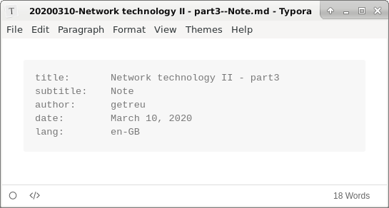{width="11cm"}

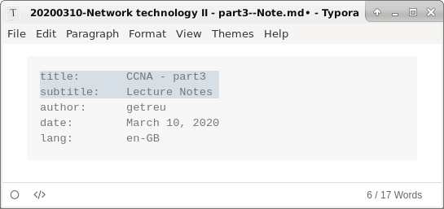{width="11cm"}

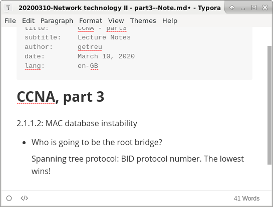{width="11cm"}

{width="10cm"}

> **Note**
>
> Before and after launching the editor _Tp-Note_ renames the file to be in
> sync with the note's metadata (i.e. title and subtitle).
> For more details see [How it works: Organize your files and notes with sort-tags].


## Copy a chapter from a web page

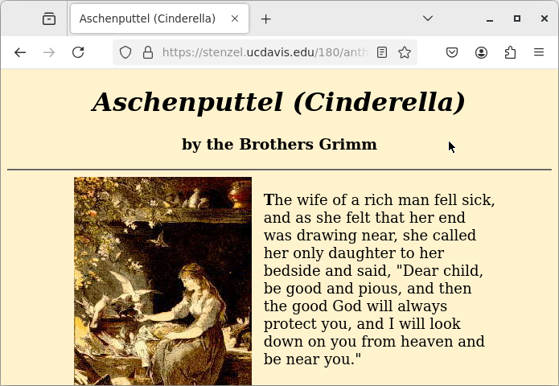


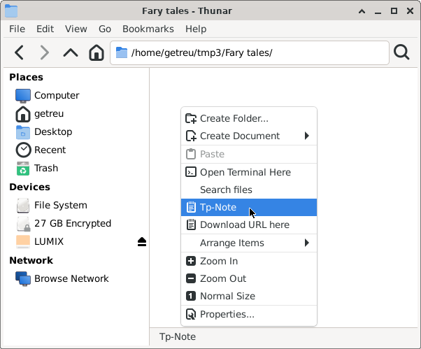

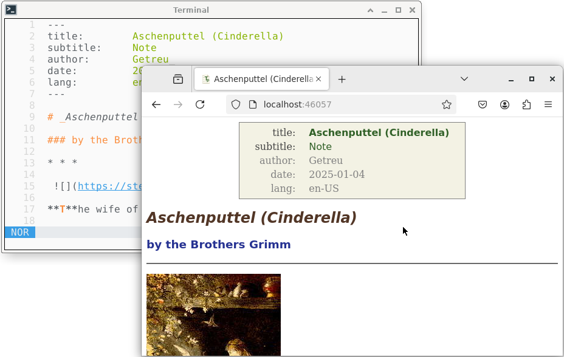

Tp-Note created the following content:

```yaml
---
title:        Aschenputtel (Cinderella)
subtitle:     Note
author:       Getreu
date:         2025-01-04
lang:         en-US
---

# _Aschenputtel (Cinderella)_

### by the Brothers Grimm

* * *

 

**T**he wife of a rich man fell sick,
```


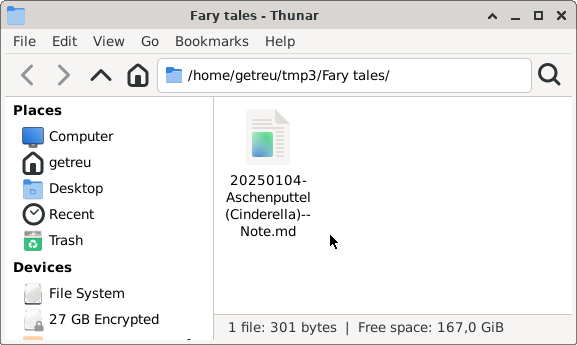


## Taking notes about a file

{width="9cm"}

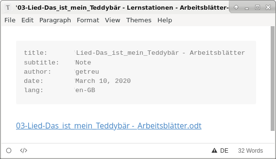{width="11cm"}

The source code of the note shows the link with its target. The left-click, opens the `.odt` document.

```yaml
---
title:      Lied-Das_ist_mein_Teddybär - Arbeitsblätter.odt
subtitle:   Note
author:     Getreu
date:       2023-09-21
lang:       en-GB
---

[03-Lied-Das_ist_mein_Teddybär - Arbeitsblätter.odt](<03-Lied-Das_ist_mein_Teddybär - Arbeitsblätter.odt>)
```

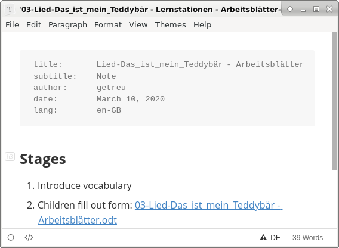{width="11cm"}

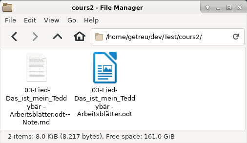{width="8cm"}


## Document the download location of a local file

The approach is similar to what we have seen in the [previous chapter](#taking-notes-about-a-file):

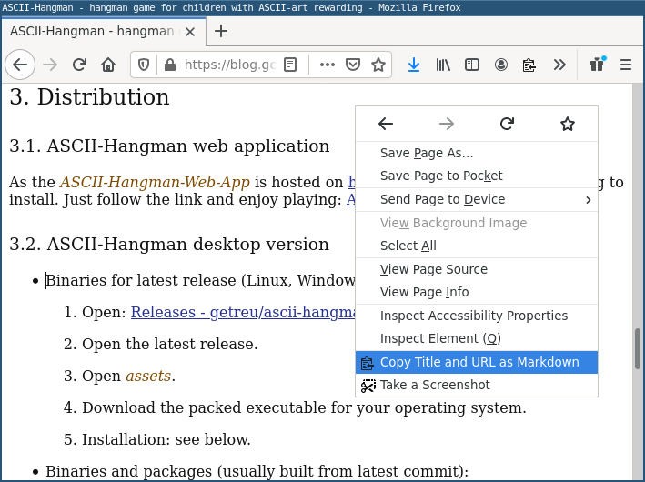{width="9cm"}

Note: for convenience I use in this example the Firefox browser addon [Copy
Selection as Markdown] to copy the hyperlink. If this addon is not available,
you can also copy the URL directly from the search bar.

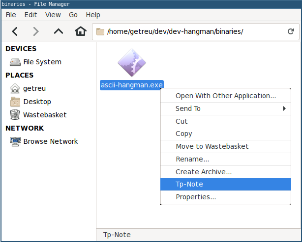{width="8cm"}

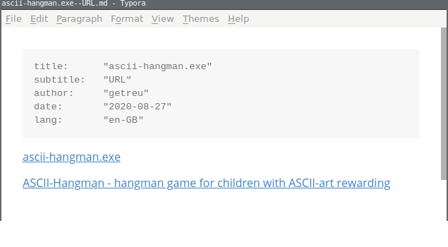{width="11cm"}

The source-code of the note shows the links with their targets.

```yaml
---
title:      ascii-hangman.exe
subtitle:   URL
author:     Getreu
date:       2020-08-27
lang:       en-GB
---

[ascii-hangman.exe](<ascii-hangman.exe>)

[ASCII-Hangman - hangman game for children with ASCII-art rewarding](<https://blog.getreu.net/projects/ascii-hangman/#distribution>)

```

{width="8cm"}


## Bookmark and comment a hyperlink

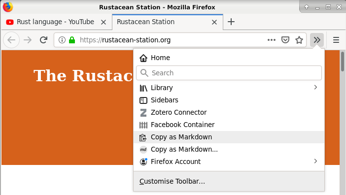{width="11cm"}

To copy a link in Markdown format a browser addon is needed. I recommend the
addon [Copy Selection as Markdown] available
for Firefox[^alternative]. 

[^alternative]: If [Copy Selection as Markdown] does not suit you, try [Copy as Markdown].

[Copy as Markdown]: https://addons.mozilla.org/en-GB/firefox/search/?q=copy%20as%20markdown
[Copy Selection as Markdown]: https://addons.mozilla.org/en-GB/firefox/addon/copy-selection-as-markdown/?src=search

{width="9cm"}

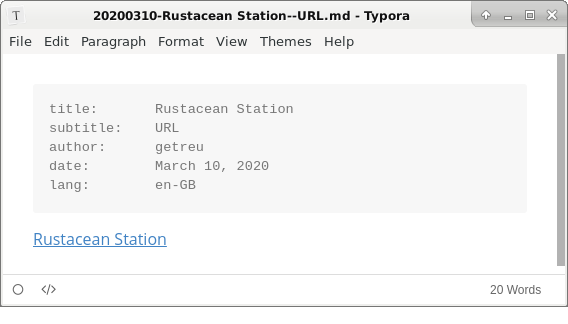{width="9cm"}

The source code of the note shows the link target:

```yaml
---
title:      Rustacean Station
subtitle:   URL
author:     Getreu
date:       2023-09-21
lang:       en-GB
---

[Rustacean Station](<https://rustacean-station.org/>)
```

In this example we copied only one Markdown link "Rustacean Station".
Furthermore, *Tp-Note* allows you also to insert a list of Markdown links in a
template. For example with [Copy as Markdown] you could copy a link list of all
open tabs. In this case, _Tp-Note_ would retain only the name of the first link
as document title, whereas the whole link list would appear in the body of the
note.

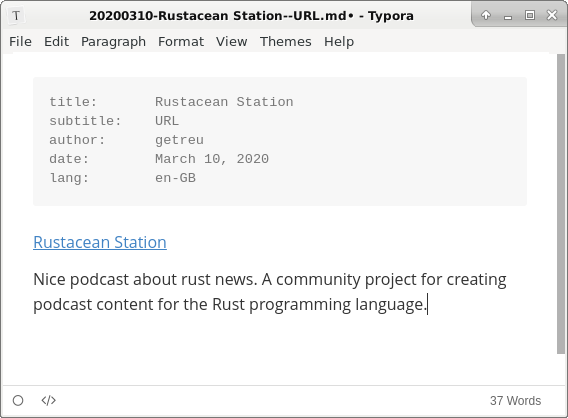{width="11cm"}

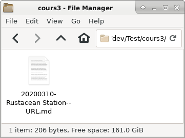{width="7cm"}

```{=docbook}
<?dbfo-need height="6cm" ?>
```


## Copy a page from a book

{width="10cm"}

{width="7cm"}

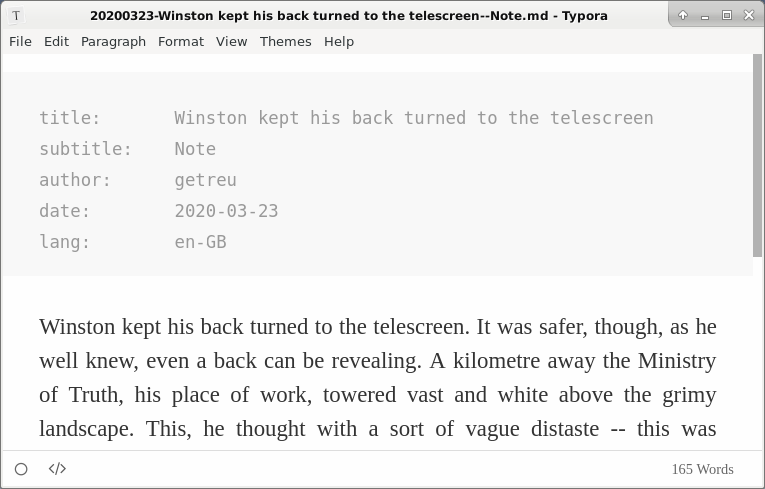{width="9cm"}

```{=docbook}
<?dbfo-need height="4cm" ?>
```

The source code of the note shows the completed template:

```yaml
---
title:      Winston kept his back turned to the telescreen
subtitle:   Note
author:     Getreu
date:       2020-03-23
lang:       en-GB
---

Winston kept his back turned to the telescreen. It was safer, though, as he well
knew, even a back can be revealing. A kilometer away the Ministry of Truth, his
place of work, towered vast and white above the grimy landscape...
```

In this example we copied only text. *Tp-Note* suggests the first sentence as
title. This can be changed before saving as illustrated above. Here we just save
and observe the file on the disk.

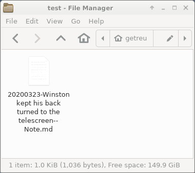{width="7cm"}

```{=docbook}
<?dbfo-need height="6cm" ?>
```


## Best practice

_Tp-Note's_ greatest advantage is its flexibility. It easily integrates with
your workflow.  As people work differently, there is no best usage either.
Nevertheless, after having used _Tp-Note_ for some years now, here my personal
preferences and configuration:

* [Tp-Note](https://blog.getreu.net/projects/tp-note/)
* Addon for Firefox: [Copy Selection as Markdown]
* Helix file editor : [Helix]
* Integration with the file manager (start entry in context menu) as described below.

Even though there are dedicated Markdown file editors for prose writing like
the excellent [Apostrophe] editor, I prefer the ergonomics of a modal editor.
My favourite at the moment is [Helix]. Please refer to the blog post
[Note talking with Helix, Tp-Note and LanguageTool](https://blog.getreu.net/20220828-tp-note-new8/) to set up [Helix] for prose writing.

When copying extracts from a web-page, I often need to preserve its hyperlinks.
When Tp-Note detects HTML in the clipboard, it automatically tries to convert
the HTML content into Markdown. Nevertheless, you may prefer using an external
converter instead. The Firefox browser add-on [Copy Selection as Markdown]
for example, precedes the copied extract with a hyperlink to the origin of the
webpage. When _TP-Note_ reads the extract from the clipboard, it uses the first
Markdown hyperlink it can find for composing the note's title and its filename
on disk. This way the web page's name ends up automatically in the note's
title and filename. Here a sample work flow:

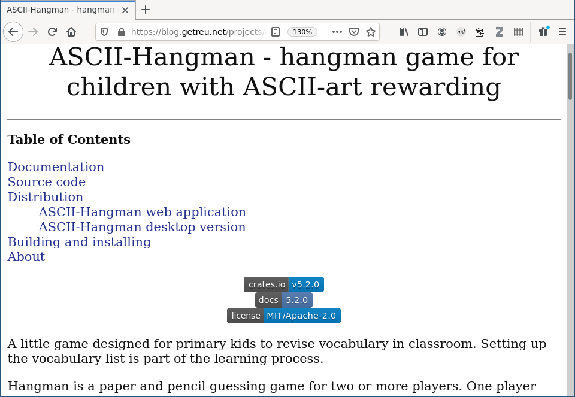{width=12cm}

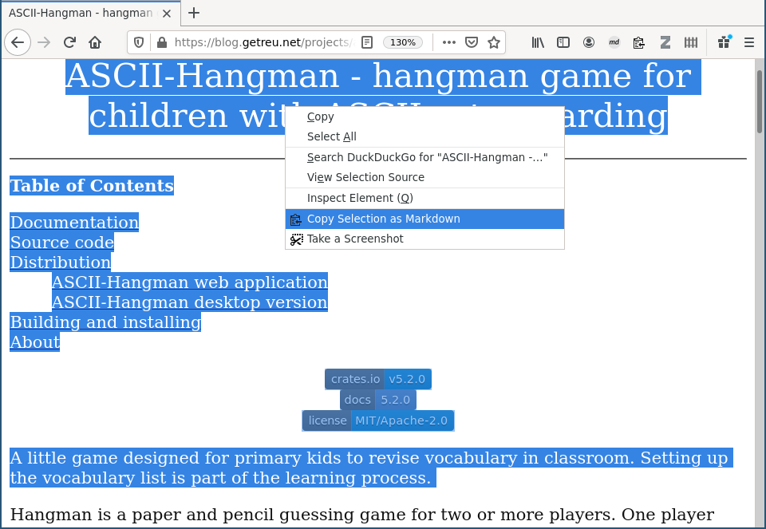{width="12cm"}

{width="8cm"}

{width="11cm"}

{width="9cm"}

Note, no content or filename was edited manually in this example. _Tp-Note_
takes care of interpreting the clipboard's content and generating the file on
disk.

[Apostrophe]: https://apps.gnome.org/en-GB/app/org.gnome.gitlab.somas.Apostrophe/
[Helix]: https://helix-editor.com/ 
[Copy Selection as Markdown]: https://addons.mozilla.org/en-GB/firefox/addon/copy-selection-as-markdown/?src=search


## Note-taking for system administrators (and console lovers)

As _Tp-Note_ makes extensive use of the clipboard, it mainly targets desktop
systems running a graphical environment. But also when working on the console
_Tp-Note_ can be useful with its built-in clipboard simulation: Instead of
copying the content into your clipboard, pipe it into _Tp-Note_:

```shell
echo  "Some clipboard content" | tpnote
```


### Typical workflows

The following examples work with the full-featured version of _Tp-Note_ as
well as with the `--no-default-features` console only version.

* Document a downloaded file:

  Download the file
  [i3-extensions.zip](http://blog.getreu.net/_downloads/i3-extensions.zip):

  ```bash
  wget "http://blog.getreu.net/_downloads/i3-extensions.zip"
  ```

  Document from where you downloaded the file:

  ```bash
  echo  "[download](<http://blog.getreu.net/_downloads/i3-extensions.zip>)" | tpnote i3-extensions.zip
  ```

  This creates the file `i3-extensions.zip--URL.md` with the
  following content:

  ```yaml
  ---
  title:      i3-extensions.zip
  subtitle:   URL
  author:     getreu
  date:       2020-09-03
  lang:       en-GB
  ---

  [i3-extensions.zip](<i3-extensions.zip>)

  [download](<http://blog.getreu.net/_downloads/i3-extensions.zip>)
  ```

* Download a webpage, convert it to Markdown and insert the result
  into a _Tp-Note_ file. The note's title is the name of the
  first hyperlink found in the webpage.

  Install `pandoc` and `curl`:

  ```bash
  sudo apt install pandoc curl
  ```

  Download and convert the HTML input internally:
  
  ```bash
  curl 'https://blog.getreu.net' | tpnote
  ```

  Or, let Pandoc do the HTML to Markdown conversion:

  ```bash
  curl 'https://blog.getreu.net' | pandoc -f html -t markdown_strict | tpnote
  ```

* Download a webpage while preserving its metadata:

  Same as above, but the following preserves the webpage's metadata, e.g.
  title, author, date... :

  ```bash
  curl 'https://blog.getreu.net' | pandoc --standalone -f html -t markdown_strict+yaml_metadata_block | tpnote
  ```

  creates the note file `20200910-Jens\ Getreu\'s\ blog.md` with the webpage's
  content.

* Generate a note for a given content with YAML header:

  ```bash
  echo -e "---\ntitle: Todo\nfile_ext: mdtxt\n---\n\nnothing" | tpnote
  ```

  creates the file `20200910-Todo.mdtxt` with the content:

  ```yaml
  ---
  title:      Todo
  subtitle:   ''
  author:     getreu
  date:       2020-09-13
  lang:       en-GB

  file_ext:   mdtxt
  ---

  nothing
  ```

* Reformat the header of a note file:

  ```bash
  mv "20200921-My Note.md" "20200921-My Note-(1).md"
  cat "20200921-My Note-(1).md" | tpnote --batch
  ```

  creates the file `20200921-My Note.md` with a rearranged header
  and the same body.

* Launch, for once only, a different text editor.\
  The external text editor, _Tp-Note_ defaults to, is defined in the configuration
  file and can be changed there. If you want to use a different text editor
  just for a one-shot, type:

  ```bash
  TPNOTE_EDITOR="geany" tpnote
  ```

  Make sure that your editor is not forking. Another example:

  ```sh
  TPNOTE_EDITOR="kate --block" tpnote
  ```

* Create a new note overwriting the template's default for `subtitle`:

  ```bash
  cd dev
  echo -e "---\nsubtitle: Draft\n---\n# Draft" | tpnote
  ```

  creates the note file `20200925-dev--Draft.md` with the content:

  ```yaml
  ---
  title:      dev
  subtitle:   Draft
  author:     Getreu
  date:       2020-09-25
  lang:       en-GB
  ---

  # Draft
  ```

* Synchronize filenames and headers of all note files in the current directory:

  ```bash
  find . -type f -name "*.md" -exec tpnote --batch {} \; >/dev/null
  ```

* Generate an HTML rendition of an existing note file in the same directory:

  ```bash
  tpnote --export='./my_notes' './my_notes/20210209-debug--Note.md'
  ```

  or, equivalent but shorter:

  ```bash
  tpnote --export='' './my_notes/20210209-debug--Note.md'
  ```

  or, even shorter:

  ```bash
  tpnote -x '' './my_notes/20210209-debug--Note.md'
  ```

* Generate a PDF rendition of an existing note file :

  Install the `weasyprint`-tool:

  ```bash
  sudo apt install  | weasyprint
  ```

  Generate the PDF rendition of the existing note `20210122-my--Note.md`:

  ```bash
  tpnote -x - '20210122-my--Note.md' | weasyprint - 20210209-debug--Note.md.pdf'
  ```

* View and follow hyperlinks in a note file:

  When no graphical environment is available, _Tp-Note_ disables the viewer
  feature with its internal HTTP server. As a workaround, use _Tp-Note_'s
  HTML export flag and pipe the result into a text based web browser. 

  Install the text based web browser `lynx`:

  ```bash
  sudo apt install lynx
  ```

  Convert the existing note `20210122-my_note.md` into HTML and
  open the rendition with `lynx`:

  ```bash
  tpnote -x - '20210122-my_note.md' | lynx --stdin
  ```

  Note, the above also works in case _Tp-Note_ was compiled with
  `--no-default-features` which is recommended for headless systems.


# How it works: Organize your files and notes with sort-tags

Consider the following _Tp-Note_-file:

    20151208-Make this world a better place--Suggestions.md

The filename has 4 parts:

    {{ fm_sort_tag }}-{{ fm_title }}--{{ fm_subtitle }}.{{ fm_file_ext }}

A so called _sort-tag_ is a numerical prefix at the beginning of the
filename. It is used to order files and notes in the file system. Besides
numerical digits and whitespace, a _sort-tag_ can be any combination of
`-_.` [^2] and is usually used as:

* *chronological sort-tag*

        20140211-Reminder.doc
        20151208-Manual.pdf
        2015-12-08-Manual.pdf

* or as a *sequence number sort-tag*.

        02-Invoices
        08-Tax documents
        09_02-Notes
        09.02-Notes

The figures below illustrate organizing files with *sort-tags".

{width="10cm"}

{width="7cm"}

When _Tp-Note_ creates a new note, it automatically prepends a *chronological
sort-tag* of today. The `{{ fm_title }}` part is usually derived from the parent
directory's name omitting its own *sort-tag*.


# Installation

Depending on the operating system, the installation process is more
or less automated and can be divided into two steps:

1. [Minimum setup without file manager integration]\
   This step consists of downloading _Tp-Note_'s binary and copying it to your hard-disk.
   See section [Distribution](https://blog.getreu.net/projects/tp-note/#distribution)
   on _Tp-Note_'s [project page](https://blog.getreu.net/projects/tp-note/#distribution)
   for a list of available packages and binaries.

2. [Optional integration with your file manager].

At the moment of this writing, an installer automating steps 1. and 2. is available for
Windows only. Packages for Debian Linux and Ubuntu help you with step 1. For other operating
systems check section [Distribution](https://blog.getreu.net/projects/tp-note/#distribution)
for precompiled binaries or
[build Tp-Note](https://blog.getreu.net/projects/tp-note/#building)
yourself.


```{=docbook}
<?dbfo-need height="6cm" ?>
```


## Minimum setup without file manager integration

_Tp-Note_'s template engine can be tested and used without file manager
integration. Download the appropriate binary for your architecture and 
place it in your `PATH`. See the 
[Distribution](../projects/tp-note/#distribution) in the
section in Tp-Note's "Readme" document for more details.

Bear in mind that the preferred way to install Tp-Note under Windows is the
[Windows installer package](../projects/tp-note/#tp-note-microsoft-windows-installer-package). However, if you do not have the right to install
software on your computer, you can place the [Tp-Note binary](../projects/tp-note/#various-binaries-for-windows-macos-and-linux) directly on your desktop. 


## Usage of the minimum setup

Once you have placed the `tpnote` binary in your `PATH` you can invoke Tp-Note
on the command line by typing `tpnote` optionally followed by a directory path
or a file path.

Having a copy (or symbolic link) of Tp-Note's binary `tpnote` on your desktop,
enables you to execute the following workflow: To create a new note, either
double-click on the _Tp-Note_-icon, or drag and drop a folder or file and drop
it on the _Tp-Note_-icon. This opens an editor with your new note.

Anyway, for more comfort, I recommend integrating _Tp-Note_ into the file
manager's context menu. See section [Optional integration with your file
manager] for more details. There you also find a list of tested Markdown
editors, if you wish to use one. _Tp-Note_ works with any Unicode text editor
and Markdown editor (see section [Optional customization] and man-page for more
details).

_Tp-Note_'s note files can be printed directly from the viewer (web browser)
window or first converted into `.html` with `tpnote -x '' mynote.md`. For other
formats e.g. `.docx`, `.odt` and `.pdf` use [Pandoc](https://pandoc.org/)
or `weasyprint`.


```{=docbook}
<?dbfo-need height="6cm" ?>
```


## Troubleshooting


### Incompatible configuration files

While upgrading _Tp-Note_, new features may cause a change in _Tp-Notes_'s
configuration file structure and the program may fail to start displaying an
error message. Please consult the following section
[Upgrading](https://blog.getreu.net/projects/tp-note/#upgrading) in the
project's Readme document for more information about incompatible configuration
files.


### Debugging

`Tp-Note`'s logging feature is controlled with the command line-options:
`--debug` and `--popup` or by the corresponding configuration file variables:
`arg_default.debug` and `arg_default.popup`.

Please consult _Tp-Note_'s manual page for more information about the
debugging options `--debug` and `--popup` and how to use them.


## Optional customization


### Chose your favourite text editor and make it default

* Your preferred text editor is not *Notepad*? Change it![^1]

  Note taking with _Tp-Note_ is more fun with a good markup (Markdown)
  text editor, although any Unicode text editor will do (even Notepad >=
  Windows 10-update 1903). _Tp-Note_ is preconfigured to work with:

  - [Apostrophe| Flathub](https://flathub.org/en-GB/apps/org.gnome.gitlab.somas.Apostrophe)
  - [VSCodium | Flathub](https://flathub.org/en-GB/apps/com.vscodium.codium)
  - [Visual Studio Code | Flathub](https://flathub.org/en-GB/apps/com.visualstudio.code)
  - [ReText — Simple but powerful editor for Markdown and reStructuredText](https://github.com/retext-project/retext)

  Please refer to [Tp-Note's man-page] to learn how to register your text
  editor with _Tp-Note_'s configuration file.


### Integrate _Tp-Note_ with your file manager

* You prefer working in a desktop environment instead of working on a shell?

  Read the following section [Optional integration with your file manager] to
  learn how to configure your file manager's context menu to launch _Tp-Note_.


### Multilingual customization

* Do you write your notes in multiple languages?

  _Tp-Note_ integrates complex linguistic heuristics to determine in what
  natural language a new note is authored and stores the result in the `lang:`
  header variable of the new note.

  This process can be configured in various ways. The most important is to
  provide _Tp-Note_ with a list of language candidates you write your notes.
  C.f. the variable `tmpl.filter.get_lang` in Tp-Note's configuration file.

  You may also want to indicate the default region codes of your preferred
  languages. C.f. the variable `tmpl.filter.map_lang` in Tp-Note's
  configuration file.

  Please refer to _customization_ section in [Tp-Note's man-page] to learn
  how to configure _Tp-Note_'s natural language processing.
  

### Choose the web browser for note viewing and make it your default

* Is your preferred web browser is not *Firefox*? Change it![^1]

  After opening the text editor, _Tp-Note_ internally renders the note file
  and opens a web browser to display the note's content. Which web browser on
  your system will be launched, depends on which of them _Tp-Note_ finds
  first by searching through a configurable list of well known web browsers.

  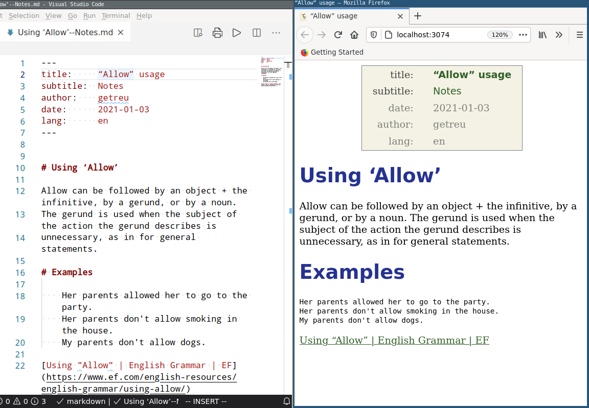{width="12cm"}

  Please refer to [Tp-Note's man-page] to learn how change which web browser
  _Tp-Note_ launches as note viewer.


### Customize the way how _Tp-Note_'s viewer renders the note's content

The way the note will appear in your web browser depends on:

* which of _Tp-Note_'s internal markup renderer is used and

* the HTML template, that defines the visual appearance
  (colours, fonts etc.) of the rendition.

Please refer to [Tp-Note's man-page] to learn how to register a file
extension with a particular markup renderer or to learn
how to change the HTML-template that renders the note's content.


### Change the default markup language

* Your preferred markup language is not *Markdown*, but ReStructuredText*,
  *Asciidoc*, *T2t*, *Textile*, *Wiki* or *Mediawiki*? Change it!

  _Tp-Note_'s core function is a template system and as such it is
  markup language agnostic. The default templates largely abstain from
  markup specific code, which makes it easy to switch the default new note's
  markup language. Please refer to [Tp-Note's man-page] to learn how to
  change its templates in the configuration file.

  In addition, _Tp-Note_ comes with a build in note viewer which is optional and
  independent from its core functionality. When _Tp-Note_ opens a note file, it
  detects the markup language through the note file extension and launches the
  associated builtin markup renderer. The whole process can be customized in
  _Tp-Note_'s configuration file. Please refer to [Tp-Note's man-page] for
  details.


# Optional integration with your file manager

This section shows how to integrate _Tp-Note_ in the context menu of your
file manager. The context menu appears, when you click right on a file icon,
on a directory icon or on the white space in between (cf. figure below). In
the following we will configure the file manager to launch _Tp-Note_ with the
path to the selected icon.

{width="9cm"}

```{=docbook}
<?dbfo-need height="6cm" ?>
```


## Windows file explorer configuration

_Tp-Note_ is distributed with a Microsoft Windows Installer package
`tpnote-x.x.x-x86_64.msi`, which automates the following key registration.
Omit this section if you have installed _Tp-Note_ through this `.msi` package!

1. Make the directory `C:\Program Files\tpnote\bin\` with Administrator rights 
   and move the binary `tpnote.exe` into it.

2. Open the *notepad* text editor and paste the following registry key into
   it.

        Windows Registry Editor Version 5.00

        [HKEY_CLASSES_ROOT\Directory\Background\shell\New Tp-Note]

        [HKEY_CLASSES_ROOT\Directory\Background\shell\New Tp-Note\command]
        @="\"C:\\Program Files\\tpnote\\bin\\tpnote.exe\""

        [HKEY_CLASSES_ROOT\*\OpenWithList\tpnote.exe]
        @=""


        [HKEY_CLASSES_ROOT\SystemFileAssociations\.txt\shell\edit.tpnote.exe]
        @="Edit Tp-Note"

        [HKEY_CLASSES_ROOT\SystemFileAssociations\.txt\shell\edit.tpnote.exe\command]
        @="\"C:\\Program Files\\tpnote\\bin\\tpnote.exe\" \"%1\""

        [HKEY_CLASSES_ROOT\SystemFileAssociations\.txt\shell\view.tpnote.exe]
        @="View Tp-Note"

        [HKEY_CLASSES_ROOT\SystemFileAssociations\.txt\shell\view.tpnote.exe\command]
        @="\"C:\\Program Files\\tpnote\\bin\\tpnote.exe\" \"-v\" \"-n\" \"%1\""

        [HKEY_CLASSES_ROOT\SystemFileAssociations\.txt\shell\export.tpnote.exe]
        @="Export Tp-Note"

        [HKEY_CLASSES_ROOT\SystemFileAssociations\.txt\shell\export.tpnote.exe\command]
        @="\"C:\\Program Files\\tpnote\\bin\\tpnote.exe\" \"--export=\" \"%1\""


        [HKEY_CLASSES_ROOT\SystemFileAssociations\.md\shell\edit.tpnote.exe]
        @="Edit Tp-Note"

        [HKEY_CLASSES_ROOT\SystemFileAssociations\.md\shell\edit.tpnote.exe\command]
        @="\"C:\\Program Files\\tpnote\\bin\\tpnote.exe\" \"%1\""

        [HKEY_CLASSES_ROOT\SystemFileAssociations\.md\shell\view.tpnote.exe]
        @="View Tp-Note"

        [HKEY_CLASSES_ROOT\SystemFileAssociations\.md\shell\view.tpnote.exe\command]
        @="\"C:\\Program Files\\tpnote\\bin\\tpnote.exe\" \"-v\" \"-n\" \"%1\""

        [HKEY_CLASSES_ROOT\SystemFileAssociations\.md\shell\export.tpnote.exe]
        @="Export Tp-Note"

        [HKEY_CLASSES_ROOT\SystemFileAssociations\.md\shell\export.tpnote.exe\command]
        @="\"C:\\Program Files\\tpnote\\bin\\tpnote.exe\" \"--export=\" \"%1\""

3. Save the file as:

   * File name: `tpnote.reg`
   * Save as type: `All files`
   * Encoding:  `UTF-16 LE`


4. Double-click on `tpnote.reg` and confirm several times.

5. Assign `tpnote` as default application for `.md`-files

   {width="8cm"}

   {width="8cm"}


## Linux file manager configuration

To simplify the configuration we first place the binary _Tp-Note_
in our `$PATH`:

```sh
cd /usr/local/bin
sudo wget https://blog.getreu.net/projects/tp-note/_downloads/x86_64-unknown-linux-gnu/release/tpnote
sudo chmod 755 tpnote
```

_Debian_ and _Ubuntu_ user can also download [Debian/Ubuntu package] and install it with:

``` sh
sudo dpkg -i tpnote_latest_amd64.deb
```


### Configure Thunar's custom actions

Most file manager allow extending the context menu. As an example, the
following images show the configuration of the *Thunar* file manger.

#### Add context menu entry: Edit Tp-Note

In *Thunar*'s menu go to:

    Edit -> Configure custom actions...

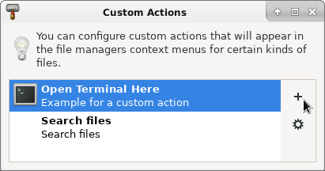{width="8cm"}

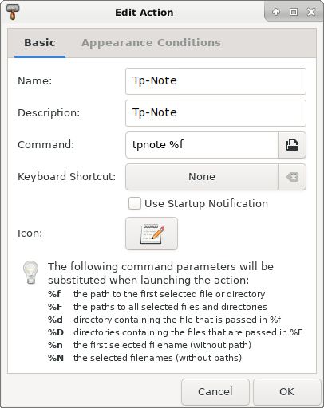{width="8cm"}

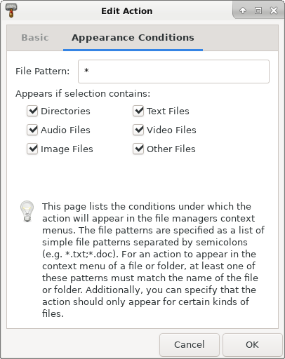{width="8cm"}

{width="8cm"}

[Debian/Unbuntu package]: https://blog.getreu.net/projects/tp-note/#tp-note-debianubuntu-installer-package

#### Add context menu entry: View Tp-Note

The following context menu entry allows us to view the rendered
note in the system's default web browser. This is very handy
when your note contains hyperlinks.

In Thunar, we add a custom action the same way as we
did before:

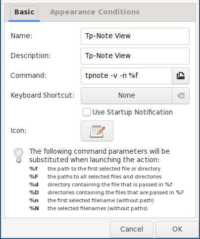{width="8cm"}

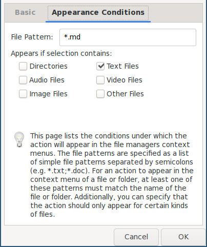{width="8cm"}

```{=docbook}
<?dbfo-need height="4cm" ?>
```


### Configure Thunar's custom actions system-wide

Alternatively, instead of manually adding custom actions for each user, you can
do this system-wide:

    sudo nano /etc/xdg/Thunar/uca.xml

Search for `</actions>` and replace it with:

```xml
<action>
  <icon>accessories-text-editor</icon>
  <name>Tp-Note</name>
  <command>tpnote %f</command>
  <description>Tp-Note</description>
  <patterns>*</patterns>
  <directories/>
  <audio-files/>
  <image-files/>
  <other-files/>
  <text-files/>
  <video-files/>
</action>
<action>
  <icon>accessories-text-editor</icon>
  <name>Tp-Note View</name>
  <command>tpnote -v -n %f</command>
  <description>Tp-Note View</description>
  <patterns>*.txt; *.md;*.rst;*.adoc;*.txtnote</patterns>
  <text-files/>
</action>
</actions>
```

The change becomes effective only after the user deletes his own configuration
file in `~/.config/Thunar/uca.xml`:

```shell
killall thunar
rm ~/.config/Thunar/uca.xml
thunar
```

```{=docbook}
<?dbfo-need height="8cm" ?>
```

**Optional bonus: add a menu entry "Download webpage as Markdown"**

In addition to the above, the following adds a context menu
entry for fast downloading and converting a webpage to a Markdown
Tp-Note file.

First install some helper programs:

    sudo apt install xclip curl pandoc

Then edit the system-wide Thunar configuration file:

    sudo nano /etc/xdg/Thunar/uca.xml

Search for `</actions>` and replace it with:

```xml
<action>
  <icon>accessories-text-editor</icon>
  <name>Download URL here</name>
  <command>curl $(xclip -o)| pandoc --standalone -f html -t markdown_strict+yaml_metadata_block+pipe_tables | tpnote  %F</command>
  <description>Download URL</description>
  <patterns>*</patterns>
  <directories/>
</action>
</actions>
```

The change becomes effective only after the user deletes his own configuration
file in `~/.config/Thunar/uca.xml`:

```shell
killall thunar
rm ~/.config/Thunar/uca.xml
thunar
```

```{=docbook}
<?dbfo-need height="8cm" ?>
```

**Optional bonus 2: add a menu entry "Export note as Pdf"**

First install the `weasyprint` filter program: 

    sudo apt install weasyprint

Then edit the system-wide Thunar configuration file:

    sudo nano /etc/xdg/Thunar/uca.xml

Search for `</actions>` and replace it with:

```xml
<action>
  <icon>accessories-text-editor</icon>
  <name>Tp-Note Export</name>
	<command>tpnote --export=- %f | weasyprint - %f.pdf</command>
  <description>Tp-Note Export</description>
  <patterns>*.txt; *.md;*.rst;*.adoc;*.txtnote</patterns>
  <text-files/>
</action>
</actions>

```

The change becomes effective only after the user deletes his own configuration
file in `~/.config/Thunar/uca.xml`:

```shell
killall thunar
rm ~/.config/Thunar/uca.xml
thunar
```

```{=docbook}
<?dbfo-need height="8cm" ?>
```


### Configure Pcmanfm's custom actions system-wide

_Pcmanfm_ is the default file manager in _Lubuntu_ and in _Raspbian_ on the
Raspberry Pi.

Create the configuration file:

    sudo nano /usr/local/share/file-manager/actions/tpnote.desktop

with the following content:

```
[Desktop Entry]
Type=Action
Name[en]=Tp-Note
Tooltip=Tp-Note
Icon=package-x-generic
Profiles=profile-zero;

[X-Action-Profile profile-zero]
Name[en]=Default profile
Exec=tpnote %f
```

The above creates the custom context menu item _Tp-Note_.

#### Note viewer

Create the configuration file:

    sudo nano /usr/local/share/file-manager/actions/tpnote-view.desktop

with the following content:

```
[Desktop Entry]
Type=Action
Name[en]=Tp-Note View
Tooltip=Tp-Note View
Icon=package-x-generic
Profiles=profile-zero;

[X-Action-Profile profile-zero]
Name[en]=Default profile
Exec=tpnote -v -n %f
```

The above creates the custom context menu item _Tp-Note View_.


### Configure the text based file manager MidnightCommander

The Ncurses library based file manager _MidnightCommander_ `mc` enjoys great
popularity among people working on the console.
As _Tp-Note_ stores the note's content in UTF-8 encoded plain text, `mc`
can be used for full text searches in all note files of a directory.
Start  the full text search with the keys `[Esc]` `[?]`.

The following instructions configure `mc`'s `[F3]`-key to open `.md` files for
viewing. This is where _Tp-Note_ generates the HTML rendition of the note
file and opens the rendition with the _Lynx_ web browser. The `[Enter]`-key
runs _Tp-Note_ in editing mode.

1. First install the _Midnight Commander_ and the _Lynx_ web browser:

   ```bash
   sudo apt install mc lynx
   ```

2. Edit `mc`'s system-wide configuration file `/etc/mc/mc.ext.ini`:

   ```bash
   sudo nano /etc/mc/mc.ext.ini
   ```

   Or, edit the user's configuration file `~/.config/mc/mc.ext.ini`:

   ```bash
   nano ~/.config/mc/mc.ext.ini
   ```
    

3. Find the following lines ():

   ```
   [markdown]
   Regex=\.(md|mkd)$
   ShellIgnoreCase=true
   Include=editor
   ```

   and disable them:

   ```
   # [markdown]
   # Regex=\.(md|mkd)$
   # ShellIgnoreCase=true
   # Include=editor
   ```

4. Replace the line `[Default]` with:

   ```bash
   regex=\\.(md|rst|adoc|txtnote)$
       Open=tpnote %f
       View=if HTML=`tpnote -b -n -x - %f`; then (echo $"HTML" | lynx --stdin); else less    %f; fi

   [Default]
   ```

5. Restart all instances of `mc` :

   ```bash
   sudo killall mc
   mc
   ```

To test the configuration, navigate to some `.md` note file and
press `[F3]` or `[Enter]`.


[^1]: _Tp-Note_ is preconfigured to work with many well-known external text
      editors: e.g.: `code`, `atom`, `retext`, `geany`, `gedit`, `mousepad`,
      `leafpad`, `nvim-qt`, and `gvim` under Linux and `notpad++` and `notepad`
      under Windows.  To register your own text editor, please consult the
      man-page.  For best user experience, I recommend text editors with
      internal markup previewer.

[^2]: The compulsory trailing `-` separator is not considered to be part of a
      sort-tag, although dashes within the sort-tag are allowed.

[Tp-Note's man-page]: http://blog.getreu.net/projects/tp-note/tpnote--manpage.html#customization
